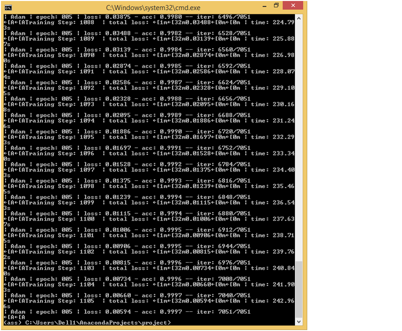
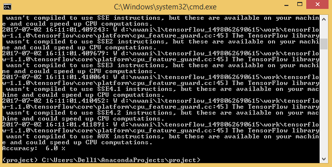
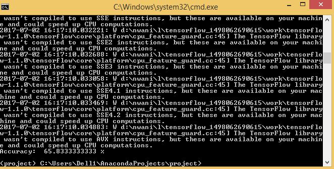

# Face-Recognition-
 

 

### Overview

The main aim of this project is human facial recognition.

Inorder to train the project we divided the dataset into 4 classes. When the trained model was tested on the dataset that was collected from internet, the accuracy was 6%.

### Dependencies

This project requires **Python 3.5** and the following
Python libraries installed:

- [NumPy](http://www.numpy.org/)
- [SciPy](https://www.scipy.org/)
- [TensorFlow](http://tensorflow.org)
- [Pandas](http://pandas.pydata.org/)
- [Matplotlib](http://matplotlib.org/) (Optional)
- [Jupyter](http://jupyter.org/) (Optional)

### How to Run the Model

This repository comes with trained model which you can
directly test using the following command.

- `python tf_cnn_train.py`

After training the dataset.This repository comes with
trained model which you can directly run using the following command.

- `python tf_cnn_test.py`

## Implementation

### DataSet

During the training the image preloader loads the dataset
and saves it in X and Y. X is the input while Y is output. After we form a
network of convolutional layer, we assign the network. Afterwards, run it for 5 epoche with
batch-size '64',learning rate alpha=0.001 and then save the model. The following figures were the results of training.

 |
 | 

Collected data are processed before feeding into the deep
neural network and those preprocessing steps are described in the latter part
of this file. 

### Dataset Statistics

The dataset consists of 7K+ images which can be downloaded from the following link.

http://cswww.essex.ac.uk/mv/allfaces/

### Data Processing 

The next stage we have a dropout probablity of  0.5. In the final state of the pipeline, we resize images to 100x100 in order to reduce training time. 

### Training

Even after cropping and resizing training images (with all
augmented images), training dataset was very large and it could not fit into
the main memory. 

## Results

When we first tested the project on our dataset the accuracy was 6% but when we tested the dataset with
datatset of University of Essex, then we got an accuracy of 65%.

#### Training

 |

#### Test

 |
 

## Conclusions

In this project, we were working on a classification problem. We mainly
focused on finding a suitable network architecture and trained a model using
University of Essex's dataset. It didn't perform as expected when we tested the model using our
own dataset.

